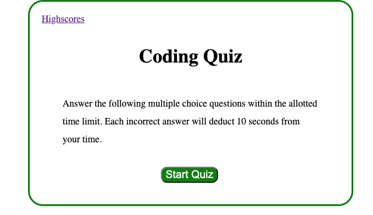
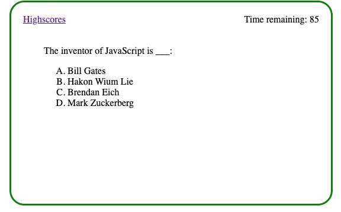
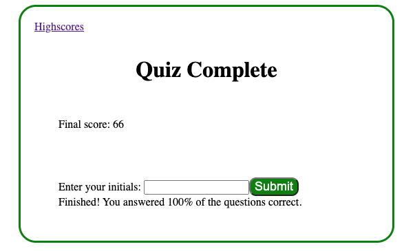
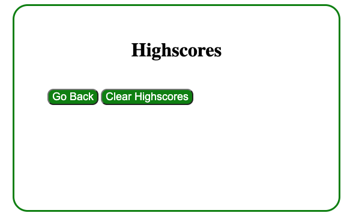

# WebAPIs_CodeQuiz_AlexPalmer

1. Description
2. Web Address
3. Usage Tips

Description:

Start of quiz.

Example of a question with running timer.

Completed quiz with grade.

Highscore page with back button & clear button.

Web Address:

Usage Tips:
- Click on the start quiz button to begin the quiz and timer. 
- Choose your answer (incorrect answers will deduct ten seconds from your score and time).
- Once you receive your final score on the "Quiz Complete" page then you will enter your initials, and submit. 
- Checkout your highscores on the "Highscores" page /// Incomplete /// 
- Click the go back button to restart the quiz.
- Click the clear highscores button to clear your highscores data. /// Incomplete ///